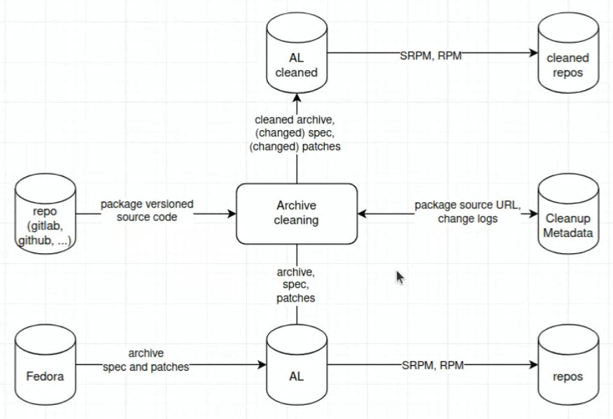

2025-01-21

Invited:

- Johannes Segitz (SUSE)
- Marc Deslauriers (Canonical)
- Mark Esler (Canonical)
- Marcus Meissner (SUSE)
- Alex Murray
- Avinash Hanwate
- Andreas Stieger (Amazon)
- Salvatore Bonaccorso (Debian)
- Moritz Muehlenhoff (Debian)
- Marco Benatto (RH)
- Patrick Del Bello (RH)
- Anthraxx (Arch)
- Freswa (Arch)
- Sam (Gentoo)
- Wolfgang Frisch (SUSE)
- Paolo Perego (SUSE)
- Filippo Bonazzi (SUSE)
- Frederic (Arch)
- Frederick Lefebvre (Amazon)
- Levent Polyak (Arch)
- Samuel Henrique (Amazon, Debian)
- Sebastien Delafond (Debian)
- Jim Perrin (Microsoft)
- Cathy Hu (SUSE)
- Stoyan Manolov (SUSE)
- Norbert Manthey (Amazon)
- Chris Gordon (Microsoft)

Participated:

- Johannes Segitz (SUSE)
- Salvatore Bonaccorso (Debian)
- Wolfgang Frisch (SUSE)
- Paolo Perego (SUSE)
- Filippo Bonazzi (SUSE)
- Samuel Henrique (Amazon, Debian)
- Stoyan Manolov (SUSE)
- Norbert Manthey (Amazon)
- Jim Perrin (Microsoft)

Topics:
- No presentation from Amazon today, will be done next month (either Frederick or Samuel)

- Move timeslot for this meeting, too soon for PST (Johannes Segitz).
  Johannes will reach out to Fred if it would help. Would also be better for Jim.

- Mailing list for the group. Options:
  - SUSE mailman: Drawback will use suse domain
  - Google group: https://groups.google.com/g/distro-security-meetup, realized only afterwards that you need a google account for this
  - We tested groups.io and that seems to work fine and require no account
  - https://lore.kernel.org/distributions/ option discussed in the first meeting
  Alternatives? What poison do you like? (Johannes Segitz).

  Will use groups.io. Wolfgang will create it after Johannes sents him the list of addresses.

- Extend RPM Specfile with additional meta data, e.g. package repo URL, commit
  ID hash, release archive creation command(s) (Norbert Manthey)

  Similar project https://repology.org/

  Basic idea:
  
  

  Questions/discussion:
  - Patches will be kept
  - ~400 packages have issues with m4 files
  - How much does break? Not fully known ATM
  - Making this publicly available would be great
  - Could be combined with reproducible builds.
  - Packages could be graded. Packages still being reproducible could get an A, packages that build at all a B,
    packages that don't have a git repo an F

  AI Johannes: Invite Bernhard Wiedeman for next meeting to discuss this further.

- Slow CVE assignments by MITRE (Johannes Segitz)

  SUSE sees delays in CVE assignments. Some dont' get assigned at all. Amazon doesn't have the problem.

- Combined efforts to score the CVEs and check affectedness

  Postponed to next meeting when we have more participants

  AI Johannes: Announce that on the new mailing list

- Another rsync regression: https://github.com/RsyncProject/rsync/issues/715
